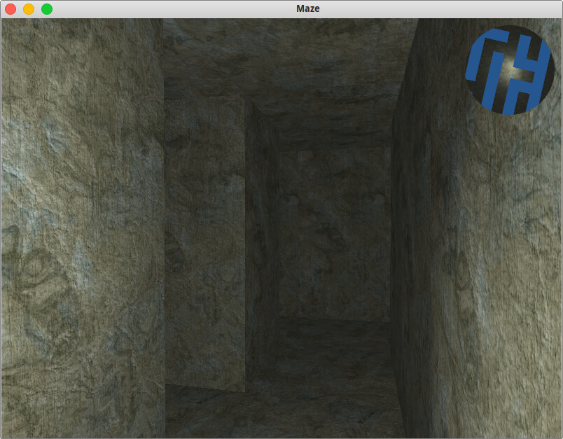

# Maze

An example of the generation of the maze map, and on its basis the creation of 3D model.
Mini map is draw using a shader.

## System requirements
The project is created in "Unity", so you need to have it on your PC.
Additional functionality of Unity Pro not used. May use common "Unity".

## License

The program is distributed under the [MIT license](./LICENSE)
